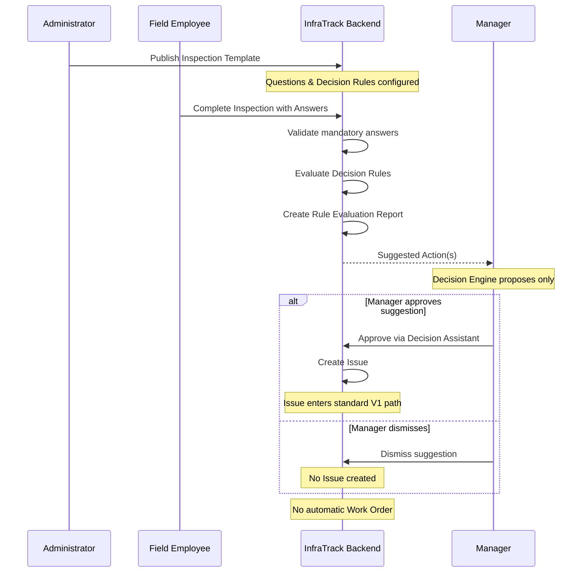
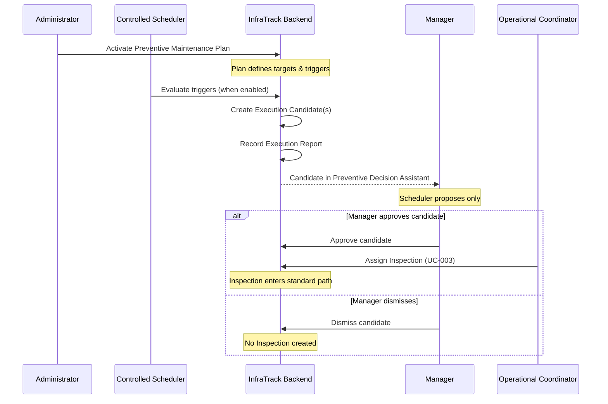
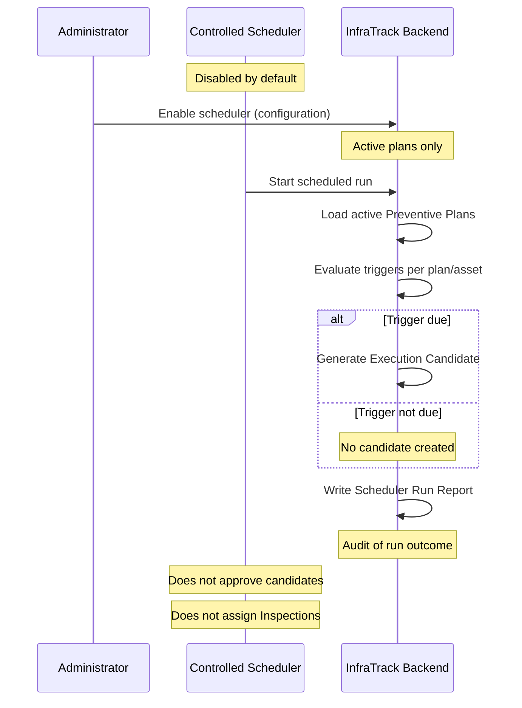
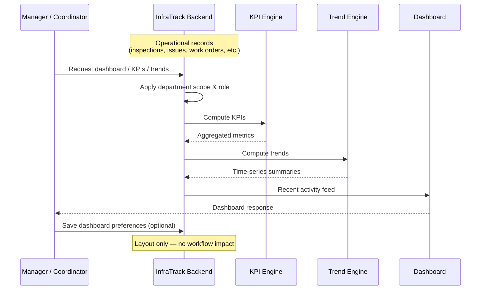
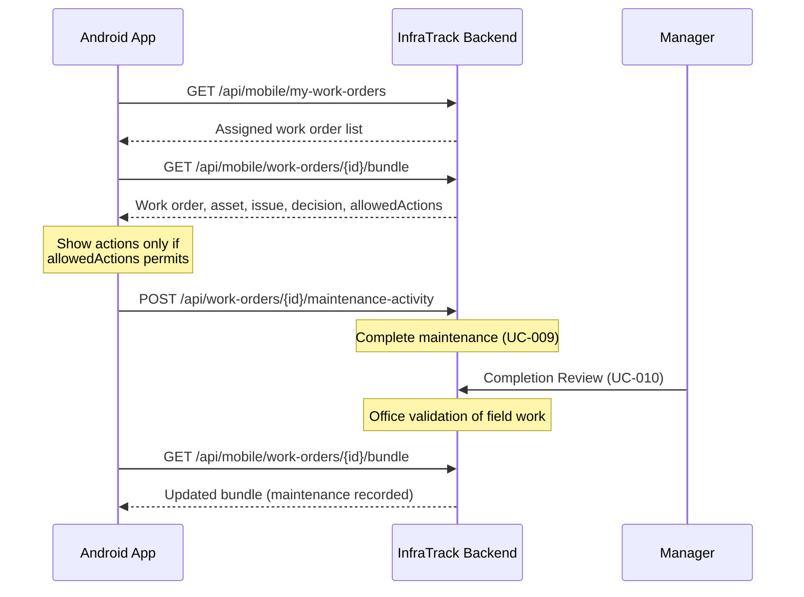
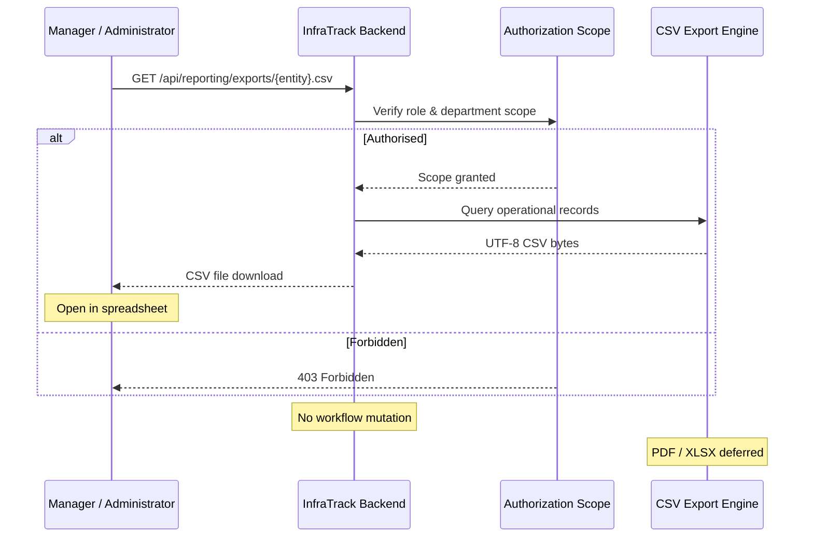

# Workflow Sequence Diagrams

## Document Information

| Field    | Value                                      |
| -------- | ------------------------------------------ |
| Project  | InfraTrack                                 |
| Document | Workflow Sequence Diagrams                 |
| Version  | 1.0                                        |
| Status   | Living Document                            |
| Audience | Product owners, engineers, API consumers   |

High-level sequence views of InfraTrack's main business workflows. These diagrams show **business sequence, ownership, and decision points** — not every service call or implementation detail.

For authoritative behaviour, see the [Domain Engine](../07-business-architecture/domain-engine.md), [Business Capability Map](../01-business-architecture/business-capability-map.md), and [API Consumer Guide](../04-api/api-consumer-guide.md).

---

## 1. Core Operational Workflow

**Purpose:** The baseline V1 lifecycle from asset registration through maintenance completion and audit trail.

```mermaid
sequenceDiagram
    participant Coord as Operational Coordinator
    participant Field as Field Employee
    participant Backend as InfraTrack Backend
    participant Manager as Manager

    Note over Backend: Asset registered (UC-001)

    Coord->>Backend: Assign Inspection (UC-003)
    Backend-->>Field: Inspection ASSIGNED

    Field->>Backend: Complete Inspection (UC-004)
    Note over Backend: Observes condition;<br/>does not authorise repair

    Field->>Backend: Record Issue (UC-005)
    Note over Backend: Problem formally recorded

    Manager->>Backend: Operational Decision (UC-007)
    Note over Backend: Authorises operational response

    Coord->>Backend: Create & Assign Work Order (UC-008)
    Backend-->>Field: Work Order ASSIGNED

    Field->>Backend: Complete Maintenance (UC-009)
    Note over Backend: Work executed in the field

    Manager->>Backend: Completion Review (UC-010)
    Note over Backend: Validates completion quality

    Backend->>Backend: Record Asset History (UC-011)
    Note over Backend: Immutable evidence preserved
```

**Key guarantees**

- Inspection **observes**; it does not repair or authorise work.
- Issue **records** a problem; it does not create a Work Order by itself.
- Operational Decision **authorises** the response before execution.
- Work Order **executes** authorised work; Maintenance Activity records what was done.
- Completion Review **validates** field work before the record is accepted.
- Asset History **preserves** evidence across the lifecycle.

---

## 2. Inspection Intelligence Workflow

**Purpose:** How structured inspection answers trigger rule evaluation and manager-reviewed suggestions (V2 Decision Engine).



**Key guarantees**

- The Decision Engine **proposes**; it does not create Issues, Work Orders, or Operational Decisions automatically.
- Rule Evaluation Report is created at **final completion** only — not during progressive answer saves.
- Manager **decides** via the Decision Assistant; dismissal has no workflow side effects.
- An Issue is created **only on explicit approval**; it then follows the standard operational path.
- No automatic Work Order is created from rule evaluation.

---

## 3. Preventive Maintenance Workflow

**Purpose:** How preventive plans surface execution candidates for manager review before any inspection is assigned.



**Key guarantees**

- The scheduler **creates candidates only** — not Inspections, Issues, or Work Orders.
- **Manager approval is required** before an Inspection is assigned from a candidate.
- Execution Report records what the scheduler evaluated; it does not mutate operational workflow.
- Approved candidates hand off to the **standard inspection assignment** process (UC-003).

---

## 4. Controlled Scheduler Workflow

**Purpose:** What the preventive scheduler does when it runs — and what it deliberately does not do.



**Key guarantees**

- Scheduler is **disabled by default**; enabling it is an explicit administrative action.
- Scheduler **evaluates triggers** and **generates candidates** — nothing more.
- Scheduler **does not approve** candidates or assign Inspections.
- Scheduler Run Report provides an audit trail of each run.
- Human approval remains mandatory before operational records are created ([BDR-002](../03-architecture/bdr-002-preventive-candidates-before-automation.md)).

---

## 5. Operations Intelligence Workflow

**Purpose:** How operational data is aggregated for dashboards without changing workflow state.



**Key guarantees**

- Operations Intelligence is **read-only** — it observes operational records; it does not create, assign, approve, or complete work.
- KPI and trend engines **aggregate** existing data; they do not trigger the Decision Engine or scheduler.
- Dashboard preferences store **display layout only**.
- Department scoping applies consistently with other read APIs.

---

## 6. Mobile Inspection Workflow

**Purpose:** How the Android field client loads, saves, and completes inspections using the shared REST API.

```mermaid
sequenceDiagram
    participant App as Android App
    participant Backend as InfraTrack Backend
    participant Engine as Decision Engine

    App->>Backend: POST /api/auth/login
    Backend-->>App: JWT token

    App->>Backend: GET /api/mobile/me
    Backend-->>App: Identity & role summary

    App->>Backend: GET /api/mobile/my-inspections
    Backend-->>App: Assigned inspection list

    App->>Backend: GET /api/mobile/inspections/{id}/bundle
    Backend-->>App: Screen payload (questions, saved answers, allowedActions)

    loop Progressive save (optional)
        App->>Backend: PUT /api/inspections/{id}/answers
        Note over Backend: Upsert only;<br/>status stays ASSIGNED
        Backend-->>App: Current saved answers
    end

    App->>Backend: POST /api/inspections/{id}/complete
    Backend->>Backend: Validate mandatory answers
    Backend->>Engine: Evaluate rules (once)
    Backend->>Backend: Rule Evaluation Report
    Backend-->>App: Completed inspection

    Note over App: allowedActions from bundle —<br/>never inferred locally
```

**Key guarantees**

- Backend is the **single source of truth** for permissions, validation, and workflow state.
- Bundle endpoint returns **one screen payload** — template, questions, saved answers, and `allowedActions`.
- `PUT /answers` saves progress only; it does **not** run the Decision Engine or change inspection status.
- `POST /complete` performs mandatory validation and triggers the Decision Engine **exactly once**.
- Mobile must use `allowedActions` from the bundle — not role-based guesses ([Mobile API](../04-api/mobile-api.md)).

---

## 7. Mobile Work Order Workflow

**Purpose:** How field workers view and complete assigned maintenance work on mobile.



**Key guarantees**

- Mobile displays **assigned work only**; list scope is enforced by the backend.
- `allowedActions` controls what the UI may offer (`canCompleteMaintenance`, etc.).
- Mobile **does not recalculate** permissions from role names or local rules.
- Maintenance completion uses the **same write endpoints** as the web application.
- Completion Review remains a **manager** responsibility in the office workflow.

---

## 8. Reporting Workflow

**Purpose:** How authorised users export operational data as CSV for offline analysis.



**Key guarantees**

- Reporting is **read-only** — exports never create, update, approve, or complete operational records.
- **Department scoping** applies (Manager/Coordinator: own department; Administrator: organisation-wide).
- Field Employees and Contractors are **forbidden** from exports.
- CSV is the current format; PDF and XLSX remain **future** capabilities ([Reporting API](../04-api/reporting-api.md)).
- Export has **no workflow impact** — it does not trigger notifications, the scheduler, or the Decision Engine.

---

## Related Documentation

| Document | Description |
| -------- | ----------- |
| [Product Vision](../00-product-vision.md) | Why InfraTrack exists and product principles |
| [Business Capability Map](../01-business-architecture/business-capability-map.md) | What the platform can do today |
| [API Consumer Guide](../04-api/api-consumer-guide.md) | How clients should consume the API |
| [Domain Engine](../07-business-architecture/domain-engine.md) | Authoritative V2 business architecture |
| [Mobile API](../04-api/mobile-api.md) | Mobile bundle and field client contract |
| [Reporting API](../04-api/reporting-api.md) | CSV export endpoints and authorization |
| [ADR-003 — V2 Domain-Driven Workflow](../03-architecture/adr-003-v2-domain-driven-workflow.md) | How V2 business domains interact |
| [BDR-001 — Human-in-the-Loop](../03-architecture/bdr-001-human-in-the-loop-decision-engine.md) | Rules suggest; managers decide |
| [BDR-002 — Preventive Candidates](../03-architecture/bdr-002-preventive-candidates-before-automation.md) | Scheduler generates candidates only |
