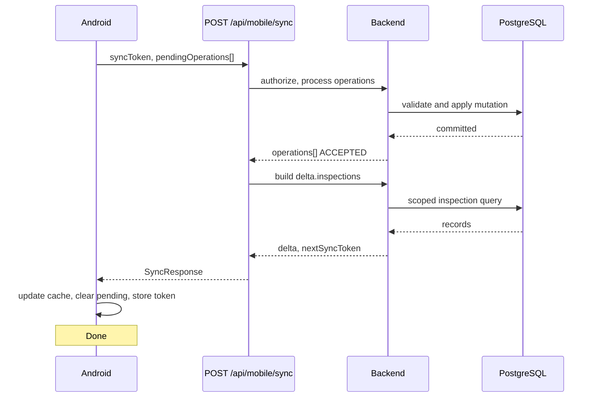
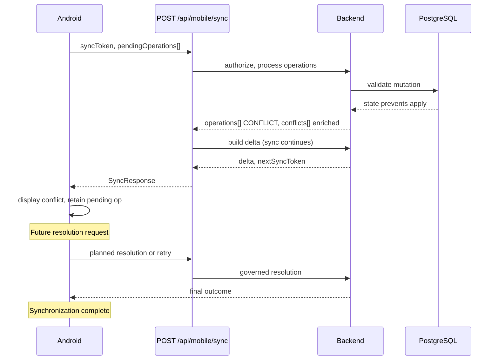

# BDR-005 — Conflict Resolution Strategy

**Status:** Accepted  
**Date:** July 2026  
**Context:** V2.5 — M5 Offline Synchronization. Conflict detection and payload enrichment delivered (M5.5-BE1 / M5.5-BE1.1). Explicit resolution endpoint delivered (M5.5-BE2). Automatic merge and durable history deferred.

**Companion to:** [BDR-005 — Offline & Synchronization Architecture](bdr-005-offline-synchronization-architecture.md)

---

## 1. Purpose

Field employees queue mutations while offline. When they reconnect, the backend may reject an operation because server state has changed since the client queued the work. That situation is a **synchronization conflict**.

### Why conflict detection exists

Conflict detection protects business integrity. An operation that was valid when queued locally may no longer be safe to apply — for example, an inspection completed by another user, an entity deleted, or a permission change. Without explicit conflict classification, clients cannot distinguish stale workflow failures from malformed payloads or validation errors.

Detection allows the platform to:

- continue processing other operations in the same sync batch;
- return structured outcomes (`CONFLICT` plus `conflicts[]`);
- preserve the client's queued work for human review;
- avoid silent data loss or ambiguous `REJECTED` responses.

### Why conflict resolution is separated from detection

**Detection** answers: *did server state prevent safe application?*  
**Resolution** answers: *what should happen to the conflicting operation and the user's local work?*

These are independent concerns:

| Concern | Responsibility | M5 status |
|---------|----------------|-----------|
| Detection | Classify conflict type; return enriched payload | **Delivered** (M5.5-BE1 / M5.5-BE1.1) |
| Resolution | Accept explicit client decisions; return outcome status | **Delivered** (M5.5-BE2 — stateless, no merge) |
| Protocol idempotency | Atomically reserve `operationId` before handler execution; duplicates receive recorded outcome | **Delivered** (DT-OFFLINE-1 / RC-FIX-BE-1) |
| Automatic merge | Apply or merge client payload server-side | **Planned** |

Separating them allows Android to integrate sync incrementally: clients can handle `CONFLICT` outcomes and display enriched payloads before any resolution endpoint or merge logic exists. The backend can evolve resolution policies without changing detection semantics.

### Relationship to BDR-005

**[BDR-005 — Offline & Synchronization Architecture](bdr-005-offline-synchronization-architecture.md)** remains the **primary** Offline Architecture document. It defines offline scope, sync protocol, connectivity states, API evolution, Android and backend responsibilities, and the M5 roadmap.

This document is a **companion** that defines the long-term **conflict resolution philosophy** — taxonomy, resolution policies, merge boundaries, lifecycle, and future evolution. It does not replace BDR-005 and does not prescribe implementation classes, endpoints, or database design.

When implementing conflict resolution sprints, both documents apply: BDR-005 for platform context; this document for conflict-specific decisions.

---

## 2. Architectural Principles

The following principles are non-negotiable for offline synchronization and conflict handling.

### PostgreSQL is always the source of truth

The authoritative business record lives in PostgreSQL. Room holds temporary mirrors and pending operations only. No client state overrides server workflow records without an explicit, server-validated resolution path.

### Android is never a business authority

The device presents data and collects user actions. It does not decide whether an inspection is complete, whether a user is authorized, or whether a work order may close. Those outcomes belong to the backend.

### Android never executes business rules

Decision Engine evaluation, Policy Engine checks, authorization, workflow transitions, and business timestamp assignment run on the server — during direct REST writes and during sync processing. Offline clients must not infer permissions from role alone or apply decision rules locally.

### Synchronization is eventually consistent

When connectivity returns, local cache converges toward server state. Until sync confirms acceptance, local data is provisional. Users may work offline, but the platform does not guarantee immediate consistency across devices.

### Conflict detection and conflict resolution are independent concerns

Detection produces classified conflicts and enriched payloads. Resolution — when implemented — consumes those outcomes and applies governed policies. Delivering detection without resolution is intentional and supported.

### Workflow completion is never automatically merged

Completing an inspection, work order, issue closure, or preventive maintenance transition is a workflow event with audit and authorization requirements. Conflicts involving completed or invalid workflow states do not trigger automatic client-side or server-side merges of completion.

### Conflict handling must always be deterministic

Given the same server state and the same queued operation, the backend must produce the same conflict classification and resolution hint. Clients must not depend on timing or implicit behaviour.

### Synchronization must remain idempotent

Re-submitting the same `operationId` must not create duplicate business records. Safe retries and repeat sync handshakes must produce predictable outcomes.

---

## 3. Conflict Taxonomy

The sync protocol classifies conflicts using `SyncConflictType`. The protocol is designed so additional types may be introduced as additive enum values without breaking existing clients (clients ignore unknown values per `protocolVersion` rules in BDR-005).

### WORKFLOW_COMPLETED

**Definition:** The target entity exists but is no longer in a state that permits the queued operation — typically because a workflow transition occurred on the server.

**Typical causes:**

- Inspection completed (no longer `ASSIGNED`);
- Inspection cancelled or reassigned such that progress save is invalid;
- Work order completed or cancelled (future sync scope).

**Expected behaviour:**

- Operation status: `CONFLICT`
- Resolution hint: `SERVER_WINS`
- `serverState` populated when the entity still exists (compact snapshot)
- Client retains the pending operation until explicit resolution or user dismissal
- No automatic merge of workflow state

### ENTITY_DELETED

**Definition:** The target entity no longer exists on the server.

**Typical causes:**

- Inspection deleted or permanently removed from scope;
- Record hard-deleted or inaccessible via normal lookup (future tombstone semantics may refine presentation).

**Expected behaviour:**

- Operation status: `CONFLICT`
- Resolution hint: `SERVER_WINS`
- `serverState`: `null` (entity not available)
- Client should not retry the same entity id without a fresh download
- Local cache refresh on next successful delta

### PERMISSION_DENIED

**Definition:** The authenticated user no longer has authority to apply the queued operation.

**Typical causes:**

- User lost assignment to the inspection;
- Role or department change;
- Account disabled (may surface as broader auth failure on sync);
- Delegated authority expired.

**Expected behaviour:**

- Operation status: `CONFLICT`
- Resolution hint: `MANUAL_REVIEW`
- `serverState` populated when entity still visible to lookup
- No silent discard — user or administrator must decide next steps
- Server does not auto-apply the client's payload

### VERSION_MISMATCH

**Definition:** Detectable concurrent modification — server state changed in a way that conflicts with the client's assumed version, but the entity may still be editable under correct conditions.

**Typical causes:**

- Duplicate answer for the same checklist question;
- Future per-entity version or optimistic concurrency token mismatch.

**Expected behaviour:**

- Operation status: `CONFLICT`
- Resolution hint: `CLIENT_RETRY`
- `serverState` populated when entity exists
- Client may refresh from delta and re-queue a corrected operation (future UX)
- Server does not auto-merge conflicting answer values without explicit policy (future)

### UNKNOWN

**Definition:** The server detected that the operation cannot be safely applied, but classification is ambiguous or maps to no specific type.

**Typical causes:**

- Unmapped `BusinessException` during sync handling;
- New server rule not yet reflected in classifier mapping.

**Expected behaviour:**

- Operation status: `CONFLICT`
- Resolution hint: `UNKNOWN`
- Conservative messaging; no assumed merge strategy
- Suitable for support review and classifier refinement

### Protocol extensibility

New `SyncConflictType` values may be added in future sprints (for example `ENTITY_MODIFIED`). Clients must tolerate unknown conflict types and unknown fields on `SyncConflictResponse`. Backend must map new types to a `SyncResolutionHint` conservatively.

---

## 4. Resolution Policies

`SyncResolutionHint` expresses **recommended** handling for the client. It is informational only. The backend does **not** execute automatic resolution when returning a hint.

### SERVER_WINS

The server state is authoritative. The client's queued mutation should not be applied as-is. The client should refresh from `delta` or targeted bundle fetch, update local cache, and discard or archive the conflicting operation after user acknowledgment.

Does **not** mean the server silently deletes client data without trace — Android should preserve unsynchronized work until the user understands the outcome.

### CLIENT_RETRY

The conflict may be recoverable after refresh. The client should download current server state, reconcile locally, and optionally submit a **new** operation (same business intent, corrected payload). Retry does not imply blind resubmission of the identical payload.

### MANUAL_REVIEW

No safe automatic path exists. A user, coordinator, or administrator must decide — for example reassign work, contact support, or discard local changes. The client displays conflict details and waits for explicit human action.

### UNKNOWN

No recommendation. Treat as `MANUAL_REVIEW` from a safety perspective until policy is defined.

### Default mapping

| Conflict type | Default resolution hint |
|---------------|-------------------------|
| `WORKFLOW_COMPLETED` | `SERVER_WINS` |
| `ENTITY_DELETED` | `SERVER_WINS` |
| `PERMISSION_DENIED` | `MANUAL_REVIEW` |
| `VERSION_MISMATCH` | `CLIENT_RETRY` |
| `UNKNOWN` | `UNKNOWN` |

These mappings are returned in `conflicts[].resolutionHint` today (M5.5-BE1.1). They guide Android UX and the explicit resolution endpoint (M5.5-BE2); they are not server-side automatic actions.

**Idempotency (DT-OFFLINE-1):** Conflict detection and explicit resolution both operate on idempotent sync operations. Re-submitting the same `operationId` returns the stored sync outcome without re-executing handlers — Android may safely retry sync after timeout before or after recording a resolution decision.

---

## 5. Merge Strategy

### What must never be merged automatically

Workflow transitions change authoritative business state and audit trails. The following must **never** be auto-merged from offline queues:

| Operation | Reason |
|-----------|--------|
| Inspection completion | Triggers Decision Engine evaluation, history events, and immutable completion timestamps |
| Work order completion | Validates performer, status, and maintenance closure rules |
| Issue closure | Operational decision with accountability requirements |
| Preventive maintenance completion | Links scheduler candidates to executed outcomes |

If server workflow state has advanced, the client's queued completion is a **conflict**, not a merge candidate.

### What may support future merge strategies

Draft-level edits — while the entity remains in an editable server state — may support controlled merge policies in future sprints:

| Data | Merge potential |
|------|-----------------|
| Draft inspection answers | Field-level or last-writer-wins **only while inspection remains `ASSIGNED`** |
| Draft maintenance notes | Append or replace policies TBD per work order rules |
| Temporary observations | Non-workflow text fields during editable states |

### Why workflow transitions differ from draft editing

**Draft editing** updates provisional fields on an entity that remains in the same workflow state (`ASSIGNED`). The server can validate each field independently.

**Workflow transitions** (for example `ASSIGNED` → `COMPLETED`) are atomic business events. They invoke authorization, validation suites, side effects (notifications, history, decision reports), and timestamps. Merging a partial or stale completion with server state would violate audit integrity and bypass server gates.

BDR-005 §5 describes entity-level strategies at platform level; this document states the architectural boundary: **completions are reject-only; drafts may be merge-eligible only under explicit future policy while editable.**

---

## 6. Backend Responsibilities

The backend owns all conflict semantics:

| Responsibility | Description | M5 status |
|----------------|-------------|-----------|
| Classify conflicts | Map service exceptions to `SyncConflictType` | Delivered |
| Generate conflict payloads | Populate `conflicts[]` parallel to `operations[]` | Delivered |
| Provide server snapshots | `SyncConflictServerState` when entity exists | Delivered |
| Provide client snapshots | `SyncConflictClientState` from queued operation | Delivered |
| Provide resolution hints | `SyncResolutionHint` per conflict type | Delivered |
| Execute resolution requests | Accept explicit resolution via `POST /api/mobile/sync/conflicts/resolve` | **Delivered** (M5.5-BE2) |
| Remain single source of truth | All accepted mutations pass existing services | Ongoing |

The backend does not trust Android workflow state. Every upload re-validates against PostgreSQL through the same service paths as direct REST writes.

---

## 7. Android Responsibilities

| Responsibility | Description |
|----------------|-------------|
| Persist pending operations | Queue mutations with stable `operationId` until outcome known |
| Display conflicts | Present `message`, `conflictType`, and enriched payload to the user |
| Preserve unsynchronized work | Do not silently delete conflicting operations |
| Never invent merge logic | Do not auto-merge workflow completions or permissions locally |
| Never modify backend workflow state locally | Do not set `COMPLETED`, assignments, or roles in Room as authoritative |
| Wait for explicit backend guidance | Use `resolutionHint` for UX only; future resolution endpoints will govern apply/discard |

Android is a **presentation and collection** layer for conflicts. Resolution authority remains on the server.

---

## 8. Conflict Lifecycle

```text
Offline edit
        ↓
Pending operation (Room queue, operationId assigned)
        ↓
POST /api/mobile/sync
        ↓
┌───────────────────────────────────────────────────────────┐
│ Per-operation processing (existing — M5.3+)               │
└───────────────────────────────────────────────────────────┘
        ↓
   Accepted? ──yes──► Remove from pending queue; apply delta
        │
        no
        ↓
   Conflict? ──yes──► Conflict detected (M5.5-BE1)
        │                    ↓
        │              Conflict payload enriched (M5.5-BE1.1)
        │                    ↓
        │              Android displays conflict (planned M5 UX)
        │                    ↓
        │              Future resolution request (planned)
        │                    ↓
        └──────────────► Synchronization completed (queue consistent)
```

### Phase status

| Phase | Status |
|-------|--------|
| Offline edit, pending queue | Android planned (M5.1+) |
| `POST /api/mobile/sync` | **Delivered** |
| Operation upload (`SAVE_INSPECTION_PROGRESS`) | **Delivered** |
| Delta download (`delta.inspections`) | **Delivered** |
| Conflict detection (`CONFLICT` + `conflicts[]`) | **Delivered** |
| Enriched payload (`serverState`, `clientState`, `resolutionHint`) | **Delivered** |
| Explicit resolution endpoint (`POST /api/mobile/sync/conflicts/resolve`) | **Delivered** (M5.5-BE2) |
| Android conflict UI | Planned |
| Automatic merge / durable conflict history | Planned |

A sync handshake **succeeds** even when conflicts occur. Conflicts are outcomes, not transport failures.

---

## 9. Sequence Diagrams

### Successful synchronization



### Conflict path



---

## 10. Future Evolution

The following capabilities are planned. None alter the principles in §2.

| Capability | Purpose |
|------------|---------|
| Work order synchronization | Upload/download for assigned work orders |
| Document synchronization | Metadata and binary cache coordination |
| Issue synchronization | Offline issue recording where in scope |
| Automatic retry policies | Server-guided retry backoff for transient classes |
| Conflict resolution endpoint | Explicit stateless decisions — **delivered M5.5-BE2**; automatic merge still planned |
| Per-entity synchronization tokens | Finer incremental consistency than global `syncToken` |
| Tombstones | Signal removals in delta without silent cache drift |
| Richer server snapshots | Additional safe fields for conflict UX |
| Optimistic concurrency | Entity version or ETag if business requires stricter merge |

New capabilities must extend the protocol additively, preserve backend authority, and map to the taxonomy and resolution policies defined here unless a successor BDR amends this document.

---

## 11. Non-Goals

This architecture intentionally does **not** attempt to solve:

| Non-goal | Rationale |
|----------|-----------|
| Peer-to-peer synchronization | InfraTrack is server-authoritative; devices sync through the backend |
| Offline business rules | Rules run on server at upload time |
| Automatic workflow merges | Completions and closures require explicit server validation |
| Android becoming authoritative | Violates thin-client and audit model |
| Immediate consistency | Offline operation implies eventual consistency |
| Distributed transactions | Single PostgreSQL source of truth; no two-phase commit across clients |

---

## 12. Related Documentation

- [BDR-005 — Offline & Synchronization Architecture](bdr-005-offline-synchronization-architecture.md) — primary offline platform document
- [Mobile API — Sync protocol](../04-api/mobile-api.md) — `SyncConflictResponse`, enums, and handshake contract
- [API Consumer Guide — Offline sync](../04-api/api-consumer-guide.md) — client integration principles
- [Domain Engine — M5 sync delivery](../07-business-architecture/domain-engine.md) — business architecture context
- [V2 roadmap — M5 milestones](../06-release-notes/v2-roadmap.md) — delivery status

---

## Consequences

### Positive

- Clear separation between detection and resolution enables incremental M5 delivery.
- Deterministic taxonomy supports consistent Android UX and support diagnostics.
- Merge boundaries protect workflow audit integrity.
- Extensible protocol avoids breaking existing clients as conflict scope grows.

### Negative / costs

- Users must understand conflicts that are not auto-resolved.
- `MANUAL_REVIEW` outcomes require operational procedures.
- Future merge policies for drafts require careful per-entity design and testing.

### Compliance

Conflict resolution implementation sprints must reference this document and BDR-005. Substantive changes to taxonomy, default hints, or merge boundaries require a BDR amendment or successor record.
